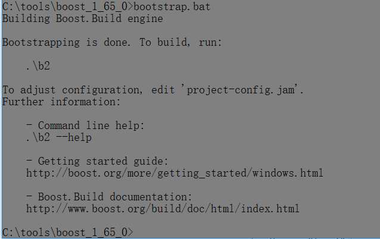
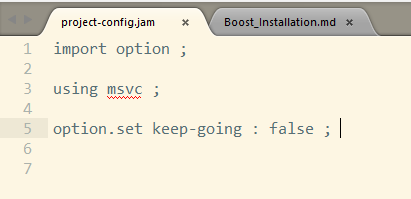
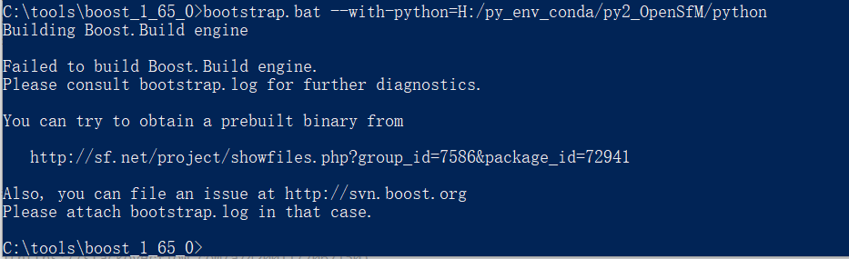
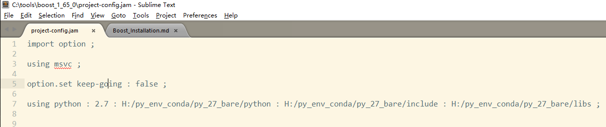
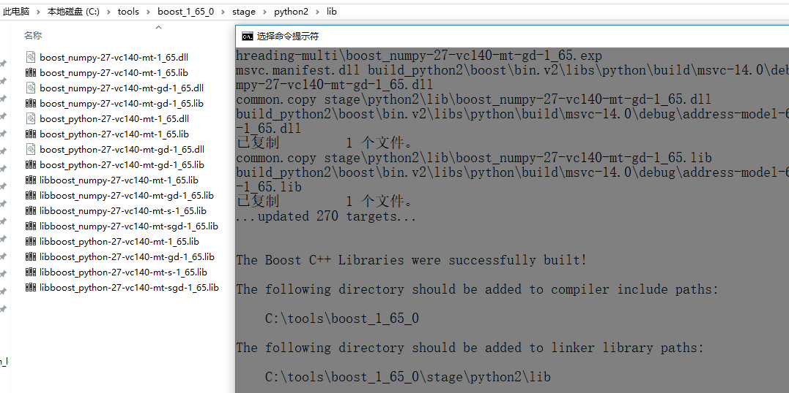

# Install Boost and Boost.Python in Windows

The boost library may be splendid, but not it's installation guide. It can be a little pain to install boost into windows (so are for many other libraries).

## Installation

* [使用CMake+Boost中遇到的几个问题](http://palanceli.com/2017/02/19/2017/0218CMake/)

* And we can [build-boost-with-multiple-python-versions](https://stackoverflow.com/questions/28830653/build-boost-with-multiple-python-versions)

* [Boost.Python 学习笔记](http://edyfox.codecarver.org/html/boost_python.html)

Back to our situation, vs2015 + windows 10:

Let's extract the downloaded boost zip from [the official website](http://www.boost.org/) (`boost_1_65_0.7z` at written time) into `C:\tools` folder, so all things go on in `C:\tools\boost_1_65_0` from now on.

And then make this folder under control by git, so we can easily remove all generated files by `git clean` when we want to do a rally **clean** rebuild.

``` vi
# 1. Add to git control
cd C:\tools\boost_1_65_0

git init
git add .
git commit -m "INIT, all files"
```


``` vi
# 2. Generate the executable files b2.exe and bjam.exe
bootstrap.bat
```



And we can have a look at the generated `project-config.jam` which determines some configurations for our build -- we are using msvc, it even did not mention which version of msvc we are using (since we did not give it any clue at all) -- other configurations are given by command line parameters as shown in `b2.exe` below.




Before we actually build it, let us type `b2.exe --help` to see what we actually need to build, there are many configurations, separated into `Project-specific help:`, `Usage`, `Targets and Related Options:`, `Other Options:`, `Properties:`, etc. And some of them are related to each other, [the first reference listed above:使用CMake+Boost中遇到的几个问题](http://palanceli.com/2017/02/19/2017/0218CMake/) gives some explanation, but not exactly true.

`b2 [options] [properties] [install|stage]`, it means we can either `install` or `stage`, the difference is that `install` will `Install headers and compiled library files to the configured locations (below).` and `stage` will ` Build and install only compiled library files to the stage directory.` As for our situation, we want to build all the libraries (prune boost will be discussed in next chapter), it is no need to install all the `headers` again, which is really big by the way since they are all the files in `<..>\boost_1_65_0\boost`, which is `110MB` in my machine.

Among all other configurations, `--build-type` is pretty interesting since the default value `minimal` gives different results on different platforms:

``` vi
-- minimal -- (default) Builds a minimal set of variants. On Windows, these are static multithreaded libraries in debug and release modes, using shared runtime. On Linux, these are static and shared multithreaded libraries in 
release mode.

-- complete -- Build all possible variations.
```

And in case we can use the dlls and more is not bad than less, right? So let's choose `complete` and build these:

```
# Build command, the parameters are pretty self-explained
b2.exe --build-dir=build --stagedir=./stage/x64 --build-type=complete  address-model=64 --toolset=msvc-14.0 -j 6
```

NOTE: the `address-model` is necessary since we need 64 bit version, `-j` will make our build much faster by using more cores in our CPU (adjust it according to your CPU, mine is 8 cores, so 6 is okay). The output is tedious, some snippets are:


```
Performing configuration checks

    - 32-bit                   : yes
    - arm                      : no
    - mips1                    : no
    - power                    : no
    - sparc                    : no
    - x86                      : yes

Building the Boost C++ Libraries.


    - symlinks supported       : no
    - junctions supported      : yes
    - hardlinks supported      : yes
    - C++11 mutex              : yes

    [...]

warning: skipping optional Message Passing Interface (MPI) library.
note: to enable MPI support, add "using mpi ;" to user-config.jam.
note: to suppress this message, pass "--without-mpi" to bjam.
note: otherwise, you can safely ignore this message.
warning: No python installation configured and autoconfiguration
note: failed.  See http://www.boost.org/libs/python/doc/building.html
note: for configuration instructions or pass --without-python to
note: suppress this message and silently skip all Boost.Python targets

    [...]

...patience...
...patience...

    [...]
    [It take more than 10 minutes here]
    [...]


The Boost C++ Libraries were successfully built!

The following directory should be added to compiler include paths:

    C:\tools\boost_1_65_0

The following directory should be added to linker library paths:

    C:\tools\boost_1_65_0\stage\x64\lib    
```


The `- 32-bit : yes` and `- x86 : yes` is a little confusing, and it seems we are not building `MPI` and `python`, our path dose not include `python` because we do not want to mess up the path and get un-intended python version involved.[THERE SHOULD BE A LINK TO OUR CLEAN PATH MECHANISM]

## TEST

As shown above, we'd better to set `BOOST_ROOT=<..>\boost_1_65_0` and add `%BOOST_ROOT%\stage\x64\lib` to `PATH`. And for easy testing, 


[...TODO...]


And if we want to build with python and specify the version of it, as said in the answer above:

``` vi
# this is for python binding, first `register` it
bootstrap.bat --with-python=H:/py_env_conda/py_27_bare/python
# then build with b2.exe

[...]
```

But before I build with `b2.exe`, one problem occurred, even deleted all produced files by `bootstrap.bat` still show this error (not so sure why):



So, we choose another method, add one line at the end of the `project-config.jam` according to the example in file `<..>\boost_1_65_0\tools\build\example\user-config.jam`:


``` vi
[...]

using python : 2.7 : H:/py_env_conda/py_27_bare/python : H:/py_env_conda/py_27_bare/include : H:/py_env_conda/py_27_bare/libs ;
```




After that we can build our new python binding:

``` vi
b2.exe --build-dir=build_python2 --stagedir=./stage/python2 --build-type=complete --with-python address-model=64 threading=multi --toolset=msvc-14.0 -j 6
```

Change the dirs to make our changes isolated. We got the new python binding as shown below, to use it, either copy to above lib folder or add this folder to path (I suggest the latter one).




## [Boost 库裁剪及其应用](http://blog.tangzhixiong.com/post-0110-boost.html)

Gives us how to prune boost and examples.
